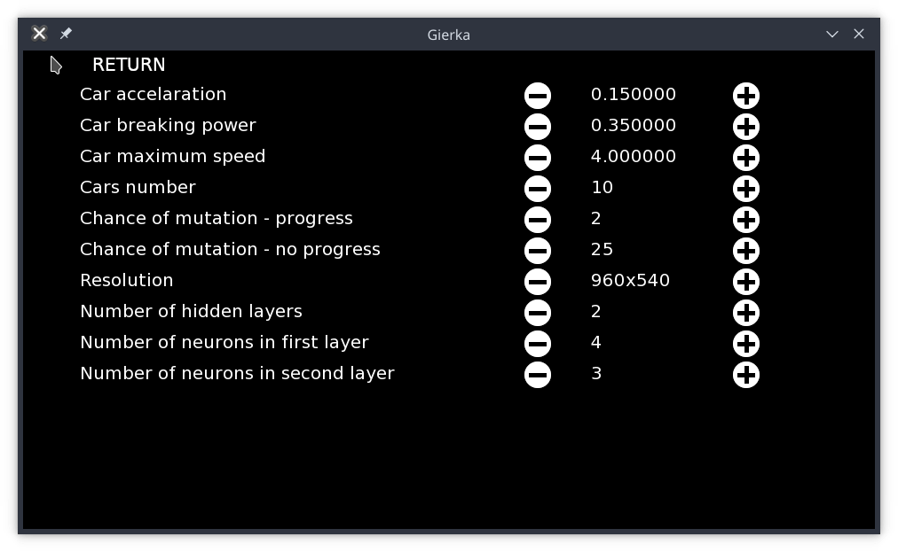

# Simple-AI

Neural Network that tries to learn complete oval track

##Compilation
1. Install SFML libraries
[SFML](https://www.sfml-dev.org/tutorials/2.5/start-linux.php)
2. Run Makefile

##Run
Binary is in the bin directory under the name "gierka"

##Description

Neural network is trained by genetic algorithm which takes two best cars for the generation and combines their network in a relation acording to which one achieved better fitness(fitness is calculated by constantly adding car's velocity, so it favors quicker cars). If generation didn't make any progress, the wages are slightly modified for every car.

###Settings

####Car acceralation
Multiplier by which a car's speed is increased

####Car breaking power
Multiplier by which a car's speed is decreased

####Cars number
Number of cars for every generation (5 - 25)

####Chance of mutation - progress
Chance in % that a neuron wage would be changed when generation fitness was better than the previous

####Chance of mutation - no progress
Chance in % that a neuron wage would be changed when generation fitness was worse than the previous

####Resolution
Resolution of a window

####Number of hidden layers
Number of hidden layers in a network (1 - 4)

####Number of neurons in n-th layer
Number of neurons for the layer